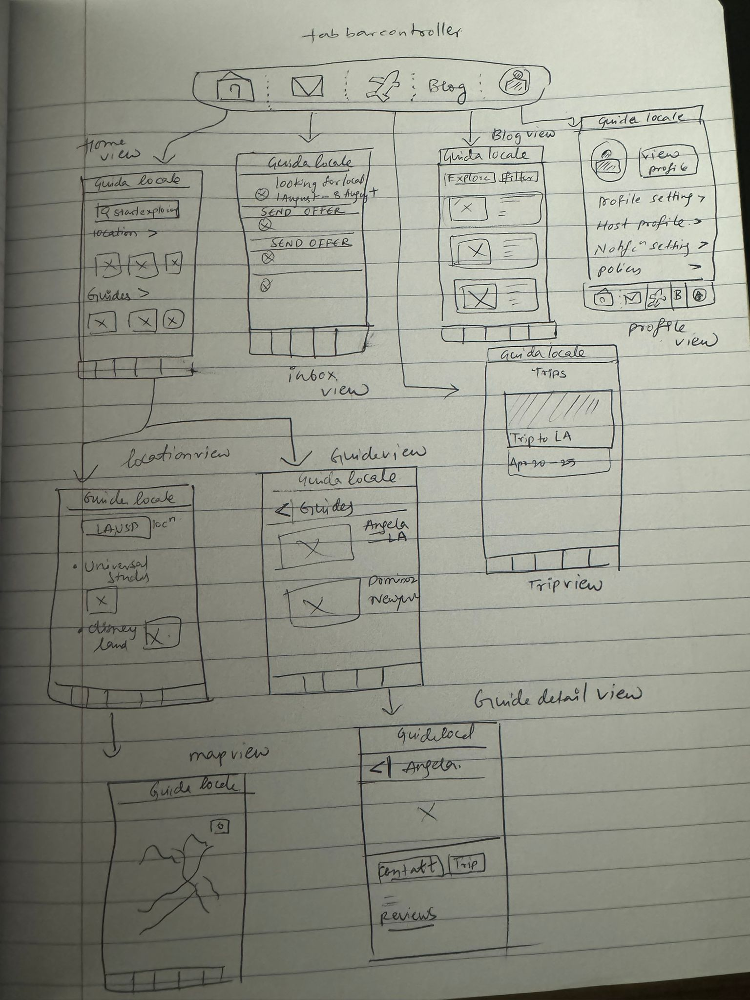

# IOS-101_Capstone-project

# guida locale

## Table of Contents

1. [Overview](#Overview)
2. [Product Spec](#Product-Spec)
3. [Wireframes](#Wireframes)
4. [Schema](#Schema)

## Overview

### Description

Guida Locale is a travel and exploring app that promotes local activities. Users can learn about hidden gems, local events, and unusual activities in their area. The app also includes a function that connects users with local guides who provide tailored tours and insights into the area's culture and history. Guida Locale aims to provide personalized, local travel experiences to tourists by offering curated guides, recommendations, and real-time updates on events and attractions. It aims to bridge the gap between travelers and local experiences, fostering a sense of exploration and discovery while allowing tourists to immerse themselves in the culture and vibe of their destination.

### App Evaluation

- **Description**: A mobile app that provides personalized, local travel experiences to tourists by offering curated guides, recommendations, and real-time updates on events and attractions.
- **Category**: Travel
- **Mobile**: Utilizes GPS, maps, and real-time updates to provide localized information, making it essential for travelers on the go. Users can interact with the app to discover nearby points of interest and receive personalized recommendations.
- **Story**: Bridges the gap between travelers and local experiences, fostering a sense of exploration and discovery. Allows tourists to immerse themselves in the culture and vibe of a destination, creating memorable experiences.
- **Market**: Appeals to travelers seeking authentic experiences and local insights. Market includes tourists visiting various destinations worldwide, with potential for partnerships with tourism boards and local businesses.
- **Habit**: Tourists would use the app frequently during their travels to explore and navigate new destinations. The app encourages exploration and interaction, making it habit-forming for travelers.
 - **Scope**: V1 focuses on providing basic guide features and recommendations. V2 could introduce personalized itineraries and AR experiences. V3 might incorporate user-generated content and social features for sharing experiences.

## Product Spec

### 1. User Stories (Required and Optional)

**Required Must-have Stories**

* Users can view curated guides for less-known locations.
* Users can access personalized recommendations for nearby points of interest, events, and attractions.
* Users receive real-time updates on events and attractions in their selected destination.
* Users can personally connect with local insiders who offer tailored tours and insights into the area's culture and history.

**Optional Nice-to-have Stories**

* Users can share their travel experiences, recommendations, and tips with the community.
* Users can interact with other users by commenting, liking, and sharing content.

### 2. Screen Archetypes

- [ ] Login Screen
* Users can log in to their existing accounts.
- [ ] Registration Screen
* Users can create a new account.
- [ ] Home Screen
* Users can search for specific locations, guides, or points of interest using filters.
- [ ] inbox Screen
* User receives suggestion to be as local guide for other people based on user location.
- [ ] Guide Screen 
* Users can view  profiles of Guides of interest and connect with local insiders and book tailored tours or experiences.
- [ ] Detail Screen
* Users can view detailed information about a specific location, event, or attraction
- [ ] Guide Detail Screen 
* Users can view  detailed profile of Guide and their reviews.  
- [ ] Profile Screen
* Users can view and edit their general information, guide profile, settings , policy and contact&support.
- [ ] Blog Screen
* Users can view curated guides, personalized recommendations, and real-time updates.
- [ ] Map screen
* Users can view maps to locate local events, local attractions.
- [ ] Trip Screen

### 3. Navigation

**Tab Navigation** (Tab to Screen)

* Home
* inbox
* trip
* Blog
* Profile

**Flow Navigation** (Screen to Screen)

- [ ] Login Screen
  * => Home
- [ ] Registration Screen
  * => Home
- [ ] Home Screen
  * => location/event Screen
  * => Guide Screen
- [ ] location/event Screen
  * => Map screen
- [ ] Guide Screen
  * => Guide detail Screen
- [ ] Profile Screen
  * => None
- [ ] Trip Screen
  * => None
- [ ] Inbox Screen
  * => None
- [ ] Blog Screen
  * => None

## Wireframes

### [BONUS] Digital Wireframes & Mockups

### [BONUS] Interactive Prototype

## Sprint Planning and Development

### Main Features

- **Home Screen**: Displaying overview for specific locations, guides, or points of interest using filters.
- **inbox Screen**: Allow users to accept request as Local guide for other users .
- **Guide Screen**: Enable users to view profiles of guides, connect with local insiders, and book tailored tours or experiences.
- **Profile Screen**: Allow users to view and edit their profile, settings, and policy.
- **Map Screen**: Enable users to view maps to locate local events and attractions.
- **Local Data Persistence**

### Breakdown into Sprints

- **Sprint 1**: Set up project structure and tab controller setup.
- **Sprint 2**: Design and implement the Home Screen and Explore Screen.
- **Sprint 3**: Build the Guide Screen and Profile Screen.
- **Sprint 4**: Implement the Map Screen and finalize features.

### Weekly Goals

- Sprint 1 Goal: Complete project setup and login screen and Tab Controller Setup .
- Sprint 2 Goal: Design and implement UI components for the Home Screen and Explore Screen.
- Sprint 3 Goal: Develop functionalities for viewing guide profiles and editing user profiles.
- Sprint 4 Goal: Integrate map functionality and finalize user interface and features.

### Weekly Submissions

- Sprint 1 :

## Schema 

[This section will be completed in Unit 9]

### Models

[Add table of models]

### Networking

- [Add list of network requests by screen ]
- [Create basic snippets for each Parse network request]
- [OPTIONAL: List endpoints if using existing API such as Yelp]
